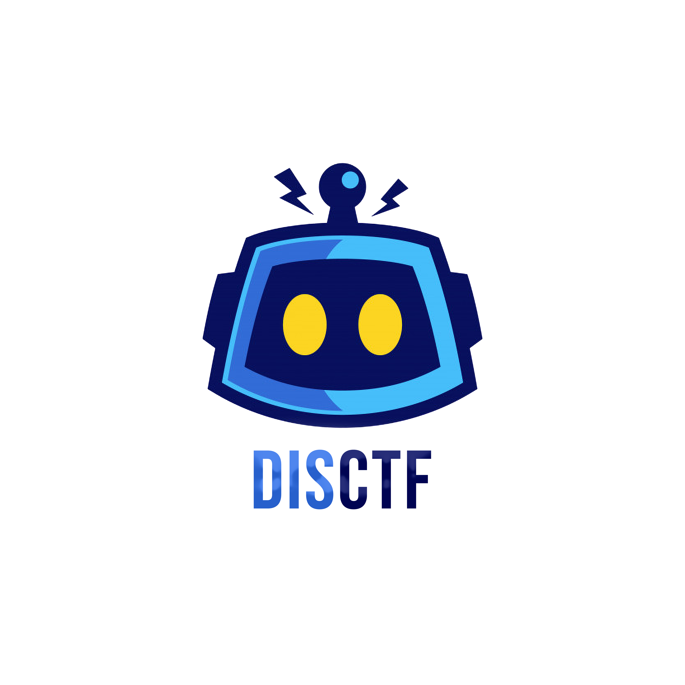

<h1 align="center">
 

 
DisCTF
</h1>
<h3 align="center">Discord Bot for Realtime Updates from CTFd</h3>
 

  

DisCTF is a Discord bot developed to connect Discord server to CTFd framework with a centralized system for real-time notifications. CTFd bot is capable of monitor real-time solves and submission and filter out valid once, sends notifications on each solves with beautiful and colorful embeds with current rank and score of the person who solved with a timestamp in it. We have a live scoreboard that notifies the people on a repeated schedule of 1 minute with ranks of the top 20 players. You can interact with CTFd framework with custom commands that are programmed to fetch particular details from server and display you the necessary Details in easy Fashion and cool look.

 

## How Bot Works :
 

The bot has an interactive Dashboard page, you have to log in with Discord and add the bot to server. Once done you can configure the CTFd by providing CTF name, URL and Discord channel to use for the notifications. You are asked for admin credentials or session token and once done, just enable the bot and it will look for submissions and notify you in the provided channel. The bot is made independent of platform, submission logs are be viewed only by admin privileged user and a normal user can't view those. We have enabled few commands like /challenge which lists out active challenges. You can also filter out a specific challenge for information and if not then a particular category too. We have enabled User and Team information as well as Scoreboard Features. We are using the rest framework of Django to connect to CTFd, and if only the user account token is provided we can get the information as well. We are using REST framework because we don't want our bot to spam your CTFd server so it won't be giving you server load also. The information used to access CTFd is not stored in any database but is only used to request for specific privileges.

 

## How to Use DisCTF:

1. Clone the repository `git clone https://github.com/aravindha1234u/DisCTF`

2. Install the Requirements `pip3 install -r requirements.txt`

3. Use your browser to login into CTFd and get admin session cookie and its URL path (Make sure you don't end the session)

4. Enable [developer options](https://support.discord.com/hc/en-us/articles/206346498-Where-can-I-find-my-User-Server-Message-ID-) in discord and copy the channel ID where you want the discord notifications

5. Create a Discord bot and edit the `bot.py` file with token would be find at [Discord Developer](https://discord.com/developers/applications) ( How to create Bot account : [link](https://discordpy.readthedocs.io/en/latest/discord.html) )

6. Start the bot to monitor the CTFd `python3 bot.py -s <session cookie> -u url -c <discord channel id>`

For adding DisCTF bot in your Discord Server use the link Below

[https://discord.com/api/oauth2/authorize?client_id=772318209129840650&permissions=0&scope=bot](https://discord.com/api/oauth2/authorize?client_id=772318209129840650&permissions=0&scope=bot)

Make sure to give proper premission for DisCTF bot with sending and receiving message for Full functioning of Bot.

if you need to give a test run before using in your big event, you demo.ctfd.io with admin credentials. 

### Support

In case, if you need help for deploying Bot for CTF event, you can join the discord chanenl with [https://discord.gg/unB3tzuS9b](https://discord.gg/unB3tzuS9b)

For service and other questions visit : [https://disctf.live](https://disctf.live)

### License

**DisCTF** is licensed under [GPL v3.0 license](https://www.gnu.org/licenses/gpl-3.0.en.html)
